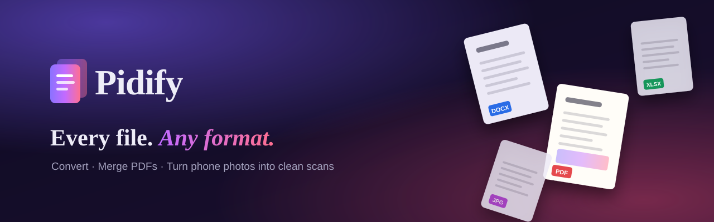
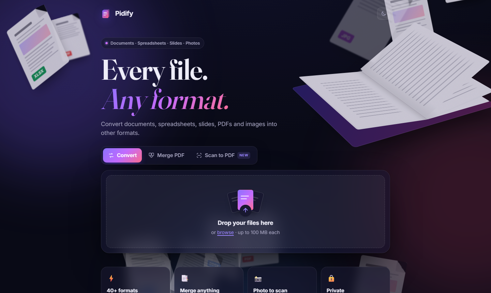
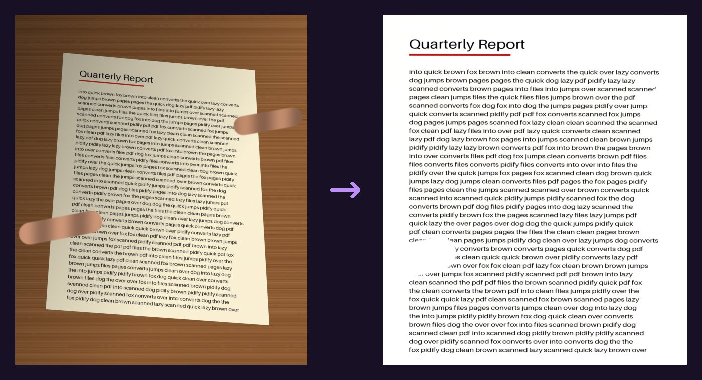

<p align="center">
  
</p>

<p align="center">
  <b>Convert anything. Merge PDFs. Turn phone photos into clean scans.</b><br>
  A good-looking, self-hosted file converter with a 3D interface.
</p>

<p align="center">
  
  
  
  
  
</p>

---

<p align="center">
  
</p>

## ✨ What it does

| | |
|---|---|
| 🔄 **Convert** | Word ⇄ PDF, Excel ⇄ CSV, PowerPoint → PDF, Markdown → Word, PDF → Word, HEIC → JPG, and 40+ other formats. Drop in a batch and convert them all at once. |
| 📑 **Merge PDF** | Mix PDFs, Word files, spreadsheets, slides and images, drag them into order, and get **one** PDF. Non-PDF files are converted automatically first. |
| 📸 **Scan to PDF** | Take a phone photo of a page. Pidify **finds the page and straightens it**, **removes the fingers holding it**, **removes shadows**, and gives you a clean PDF. |
| 🌗 **Light & dark** | Follows your system theme, with a toggle in the corner. |
| 🔒 **Private** | Files are processed on your own server and deleted as soon as the download is ready. Nothing is stored. |

## 📸 Scan to PDF: photo in, clean page out

<p align="center">
  
</p>

For each photo, Pidify:

1. **Finds the page** (the largest bright four-sided shape) and flattens it, removing the tilt and cropping out the table.
2. **Removes fingers and thumbs**: skin-coloured shapes reaching in from the edge of the page are painted over with clean paper.
3. **Evens out the lighting**, so shadows and yellow lamp tint disappear while ink colours stay.
4. Saves the page in **Colour**, **Grey** or **Black & White**.

Every photo gets a live before/after preview with a comparison slider, and each step can be turned off.

> **Note:** text that was hidden under a finger isn't in the photo, so that spot comes out blank. If a skin-toned picture sits right at the edge of your page, turn off *Remove fingers & thumbs*.

## 📂 Supported formats

| From | To |
|---|---|
| **Word**: doc, docx, odt, rtf, txt | pdf, docx, doc, odt, rtf, txt, html, md, epub, png/jpg pages |
| **Markdown / HTML / EPUB / RST / LaTeX** | pdf, docx, odt, rtf, html, md, txt, epub |
| **Spreadsheets**: xls, xlsx, ods, csv | pdf, xlsx, xls, ods, csv, html, png/jpg pages |
| **Slides**: ppt, pptx, odp | pdf, pptx, ppt, odp, png/jpg pages |
| **PDF** | docx, txt, html, png/jpg pages |
| **Images**: png, jpg, webp, bmp, gif, tiff, ico, heic | each other, and pdf |
| **Photos of paper** | one cleaned-up, multi-page PDF |

If a file has several pages and you convert it to images, you get a ZIP with one image per page.

## 🚀 Run it

### With Docker (easiest, everything included)

```bash
docker build -t pidify .
docker run -p 8000:8000 pidify
```

Open **http://localhost:8000**.

### On your own machine

You need **Python 3.10+**, **[LibreOffice](https://www.libreoffice.org/)** and **[Pandoc](https://pandoc.org/)**.

```bash
python -m venv .venv
.venv/bin/pip install -r requirements.txt        # Windows: .venv\Scripts\pip install -r requirements.txt
.venv/bin/uvicorn app.main:app --port 8000        # Windows: .venv\Scripts\uvicorn app.main:app --port 8000
```

On Windows you can also just double-click **`run.bat`**.

LibreOffice and Pandoc are found automatically. You can set `SOFFICE_PATH` / `PANDOC_PATH` to point to them yourself.

### Hosting it online

Pidify needs LibreOffice (about 600 MB) and accepts large uploads, so it needs a host that runs **Docker containers**, such as [Render](https://render.com), [Railway](https://railway.app), [Fly.io](https://fly.io) or Google Cloud Run. The included `Dockerfile` works on all of them and reads the `PORT` variable they provide. Serverless function hosts like Vercel or Netlify won't work for the backend: their size and upload limits are too small.

## 🧱 How it's built

```
app/
  converters.py   Conversion engine: picks a backend per format pair
                  (LibreOffice, Pandoc, PyMuPDF, pdf2docx, Pillow) and merges PDFs
  scanner.py      Photo clean-up with OpenCV: page detection, perspective fix,
                  finger removal, lighting correction, B&W
  main.py         FastAPI server
static/
  index.html      The page
  style.css       Design system, light/dark themes, CSS-3D book and pages
  scene.js        Floating 3D documents + mouse parallax
  app.js          Upload, convert, merge and scan UI
Dockerfile        Everything in one image
```

### API

| Method | Endpoint | Does |
|---|---|---|
| `GET` | `/api/formats` | Which formats each input can become |
| `POST` | `/api/convert` | `file` + `target` → converted file |
| `POST` | `/api/merge` | `files[]` (in order) + `name` → one PDF |
| `POST` | `/api/scan/preview` | `file` + options → cleaned JPEG preview (`X-Scan-Info` header says what was fixed) |
| `POST` | `/api/scan` | `files[]` + `mode` (`color`/`gray`/`bw`), `crop`, `marks`, `light`, `name` → one PDF |

Limits: 100 MB per file; 50 files and 300 MB in total for merges and scans.

## 🗺️ Ideas for later

- Split, rotate, compress and password-protect PDFs
- Audio & video conversion (FFmpeg)
- OCR, to make scanned PDFs searchable
